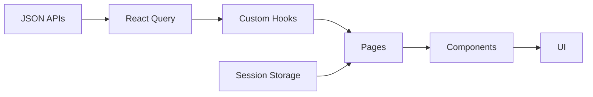

# Portfolio Project - README

A modern React portfolio showcasing projects with smart navigation and caching.

## Quick Start

**Prerequisites:** Node.js 18+ and npm

```bash
# Clone the repository
git clone <your-repo-url>
cd portfolio

# Install dependencies
npm install

# Start development server
npm run dev
```

Open your browser and visit: `http://localhost:5173`

The app will automatically reload when you make changes.

## Stack

- React 19 + TypeScript + Vite
- TanStack Router (file-based routes)
- React Query (caching & prefetch)
- Custom utility styles

## Features

- Project grid with search and category filters
- Rich project detail pages with galleries
- Smart session persistence (preserves scroll & filters)
- Hover prefetching for instant navigation
- Mobile-responsive dark theme

## Scripts

```bash
npm run dev      # Development server
npm run build    # Production build
npm run preview  # Test production build
npm run lint     # Code linting
```

## Project Structure

src/
├── routes/ # File-based routing
├── pages/ # Page components (Projects, ProjectDetails)
├── components/ # Reusable UI components
├── hooks/ # Data fetching with React Query
└── main.tsx # App entry point

public/api/ # Static JSON data
├── projects-simple.json # List view data
└── project-details.json # Detail view data

## Data Management

Projects are stored as static JSON files:

- `projects-simple.json` - Lightweight list data
- `project-details.json` - Full project details with galleries

React Query handles caching with 5-10 minute stale times and hover prefetching.

## Navigation Flow

1. **Projects List** (`/projects/`) - Grid with filters and search
2. **Project Details** (`/projects/:id`) - Full detail page
3. **Smart Return** - Preserves scroll position and loaded items

### Local Development Setup

**Prerequisites:** Node.js 18+ (download from [nodejs.org](https://nodejs.org/))

**Setup steps:**

**Step 1:** Clone the repository:

```bash
git clone <repository-url>
cd portfolio
```

**Step 2:** Install dependencies:

```bash
npm install
```

**Step 3:** Start development server:

```bash
npm run dev
```

- Opens at `http://localhost:5173`
- Hot reload enabled for instant changes
- React Query devtools available in browser

**Step 4:** Build for production:

```bash
npm run build
npm run preview  # Test production build locally
```

### Available Scripts

### Adding New Projects

1. Add entry to `projects-simple.json`
2. Add detailed entry to `project-details.json` (matching ID)
3. Place images in `public/images/`

### Component Guidelines

- Use TypeScript with strict types
- Handle loading/error states consistently
- Follow existing patterns for React Query hooks

## Deployment

**Vercel** (recommended):

```bash
npm run build
npx vercel deploy --prebuilt --prod
```

**Other platforms**: Ensure SPA fallback to `index.html` for client-side routing.

## Performance Features

- Route-based code splitting
- React Query background updates
- Image lazy loading
- Session state persistence
- Hover prefetching

## Architecture



Data flows from static JSON through React Query hooks to pages and components. Session storage preserves scroll position, filters, and loaded count for seamless navigation.

## Browser Support

Modern browsers supporting ES2020+ and React 19.

---

For detailed documentation, see:

- `CONTRIBUTING.md` - Developer guide
- `DEVELOPER_GUIDE.md` - Comprehensive architecture docs
